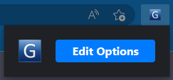
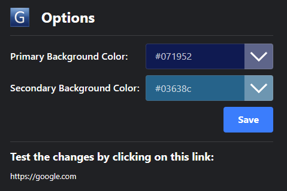
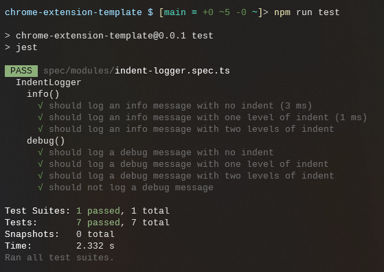

# Chrome Extension Template

This is a template project that anyone can use as a starting point to build their own Chrome manifest v3 extension. The purpose of this template is to demonstrate how to build an extension using TypeScript and SASS, and to showcase best practices for folder and file organization, as well as configuration for popular tools like ESLint and Webpack.

## Installation and Usage

To use this template, follow these steps:

1. Clone this repository to your local machine.
2. Run `npm install` to install the required dependencies.
3. Run `npm run build` to build the extension into the dist folder.
4. Load the extension into Chrome by following these steps:
   - Open the Extension Management page by navigating to chrome://extensions.
   - Enable Developer Mode by clicking the toggle switch next to Developer mode.
   - Click the LOAD UNPACKED button and select the extension directory (dist folder) that was created in step 3.
5. The extension is now installed and running. Navigate to Google to see it in action!  Check out the Options page to change background colors and refresh the Google page.

If you want to see your changes during development, execute `npm run watch` in one terminal, then execute `npm run edge` (or `npm run chrome`) in another terminal. As you make changes to your source files and save, the watch command will update the code for the extension.  Then you can reload the extension and refresh the browser page to see your changes.

If you want to write unit tests, you can add to the `spec` folder.  I have implemented unit tests for the IndentLogger module using Jest as an example.  Among other things, those tests demonstrate how you can mock the console for unit tests.  You can run `npm run test` to see the results.  The point here isn't to provide exhaustive code coverage, it is to better enable a developer to hit the ground running without having to figure out all of the plumbing, so to speak.

Note that there are several placeholders where you'll need to replace the text as appropriate for you and your extension.  In `manifest.json` you'll need to set your name, the title and description for the extension.  In `package.json` you'll need to set the author and description.  In LICENSE you'll need replace my name with your name.  In `popup-page.html` and `options-page.html` you'll need to set the title.

## Screenshots







## Project Structure

* `.vscode/settings.json` - Visual Studio Code workspace settings file.
* `spec` - Tests
* `src` - The root directory for all source code.
  * `content-scripts` - Directory containing the two content scripts.
  * `html` - Directory containing the two HTML files for the options and popup pages.
  * `icons` - Directory containing the icon images for the extension.
  * `modules` - Directory containing utility TypeScript modules used throughout the project.
  * `sass` - Directory containing the SASS files for styling the options and popup pages.
  * `options-page.ts` - TypeScript file for the options page.
  * `popup-page.ts` - TypeScript file for the popup page.
  * `service-worker.ts` - TypeScript file for the service worker.
* `vendor` - Directory containing third-party libraries or modules.
* `.eslintignore` - File containing patterns of files and folders to be ignored by ESLint.
* `.eslintrc.js` - ESLint configuration file.
* `.gitignore` - File containing patterns of files and folders to be ignored by Git.
* `.hintrc` - Configuration file for the HTMLHint linter.
* `LICENSE` - The license file for the project.
* `README.md` - The project's README file.
* `manifest.json` - The manifest file for the extension.
* `package-lock.json` - NPM package lock file.
* `package.json` - NPM package.json file.
* `tsconfig.json` - TypeScript configuration file.
* `webpack.dev.js` - Webpack development configuration file.
* `webpack.prod.js` - Webpack production configuration file.
* `webpack.shared.js` - Webpack shared configuration file.

<details>
  <summary>Tree view</summary>

```
|-- .vscode
|   `-- settings.json
|-- spec
|   |-- modules
|       `-- indent-logger.spec.ts
|-- src
|   |-- content-scripts
|   |   |-- google-search.ts
|   |   `-- google.ts
|   |-- html
|   |   |-- options-page.html
|   |   `-- popup-page.html
|   |-- icons
|   |   |-- 128x.png
|   |   |-- 16x.png
|   |   |-- 32x.png
|   |   |-- 48x.png
|   |   `-- bad.png
|   |-- modules
|   |   |-- dom.ts
|   |   |-- indent-logger.ts
|   |   |-- index.ts
|   |   |-- locker.ts
|   |   `-- options.ts
|   |-- sass
|   |   |-- base.scss
|   |   |-- options-page.scss
|   |   `-- popup-page.scss
|   |-- options-page.ts
|   |-- popup-page.ts
|   `-- service-worker.ts
|-- vendor
|   `-- color-picker
|       |-- color-esm.js
|       |-- color-palette-esm.js
|       |-- color-palette.js
|       |-- color-picker-element.js
|       |-- color-picker-esm.js
|       |-- color-picker.css
|       |-- color-picker.js
|       `-- color.js
|-- .eslintignore
|-- .eslintrc.js
|-- .gitignore
|-- .hintrc
|-- LICENSE
|-- README.md
|-- manifest.json
|-- package-lock.json
|-- package.json
|-- tsconfig.json
|-- webpack.dev.js
|-- webpack.prod.js
`-- webpack.shared.js
```

</details>

## Features

- TypeScript
- SASS
- Webpack
- ESLint
- Jest
- Color picker from [thednp/color-picker](https://github.com/thednp/color-picker)
- Content scripts that target specific URL patterns and get automatically injected by the browser
- Separate configuration files for development and production builds
- Helper modules for managing storage, interacting with the DOM, logging, etc.
- Option to choose primary and secondary background colors for Google
- Responsive Google search textbox that expands and contracts with the page
- Cross-browser compatible: tested in Chrome and Edge (Chromium)
- MIT license

## Webpack

The project uses Webpack to build the production version of the extension. There are three separate configuration files for Webpack:

- `webpack.shared.js`: contains configuration that is used by both `webpack.dev.js` and `webpack.prod.js`
- `webpack.dev.js`: contains configuration used for development
- `webpack.prod.js`: contains configuration used for production

The `webpack.shared.js` file has the majority of the configuration, including the entry points, module rules, output, and plugins. The `webpack.dev.js` and `webpack.prod.js` files import this shared configuration file and modify it as needed.

The `entry` property of the Webpack configuration specifies the entry points for the extension. The `contentScripts` object specifies the two content scripts used by the extension, the `modules` object bundles all of the helper TypeScript files together into a single JavaScript file, while the other entries specify the main scripts used by the options page, popup page, and service worker.

The `module` property specifies the loaders to use for different file types. In this project, the `ts-loader` is used for TypeScript and JavaScript files, while `css-loader`, `sass-loader`, and `mini-css-extract-plugin` are used to transpile and extract CSS from SASS files.

The `optimization` property is set to disable all optimizations for this project, but you can change this as needed for your own use case.

The `output` property specifies the output location and file names for the transpiled code. In this project, the transpiled JavaScript and CSS files are output to the `dist` directory.

The `plugins` property contains an array of plugins to use for the build. In this project, `ESLintPlugin`, `MiniCssExtractPlugin`, and `CopyPlugin` are used to lint the code, extract CSS, and copy necessary files to the `dist` directory, respectively.

## TSConfig

Browsers understand JavaScript, but not TypeScript, so we need to transpile (or convert) it to JavaScript.  We use a `tsconfig.json` file for TypeScript compilation that is configured for `node` module resolution and `es2020` for both the module and target.  It writes its output to the `dist` directory.  We can manually run the compiler with `npx tsc <filename>` if needed, but we have configured Webpack and `ts-loader` to do this for the entire project based on the configuration provided by the `tsconfig.json` file.

## ESLint

This project uses ESLint to enforce coding standards and prevent common errors. It is configured with an `.eslintrc.js` file, which extends `eslint:recommended` and `plugin:@typescript-eslint/recommended` rulesets, and uses `@typescript-eslint/parser` as the parser and `@typescript-eslint` as a plugin. The environment is configured for browser, es2020 and node.

To run the linter, execute the following command in the terminal: `npm run lint`.  This will lint all TypeScript and JavaScript files in the project.

### Ignored files
The .eslintignore file lists all the files and directories that should be ignored by the linter. By default, this file ignores `node_modules` and the `dist` directory, but I added the `color-picker` directory as well since it is 3rd party vendor code.

## License

This project is licensed under the [MIT License](LICENSE) - see the LICENSE file for details.

## Contributing

Contributions are welcome! Please open an issue or [pull request](https://github.com/yourusername/chrome-extension-template/pulls) for any changes you'd like to see.

## Acknowledgments

* [Chrome Developers Documentation](https://developer.chrome.com/docs/extensions/)
* [Webpack Documentation](https://webpack.js.org/)
* [TypeScript Documentation](https://www.typescriptlang.org/docs/)
* [SASS Documentation](https://sass-lang.com/documentation)
* [ESLint Documentation](https://eslint.org/docs/user-guide/getting-started)
* [HTMLHint Documentation](https://htmlhint.com/docs/user-guide/)
* [Color Picker](https://github.com/PitPik/color-picker) - Used to select background colors on the options page.

## Authors

* Kyle Kolander - Initial work - [KyleKolander](https://github.com/KyleKolander)


